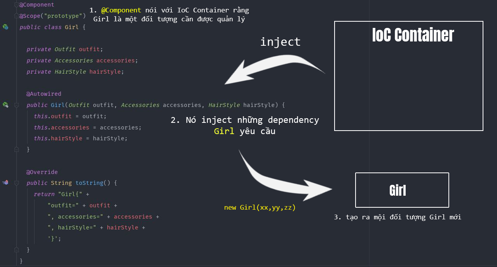
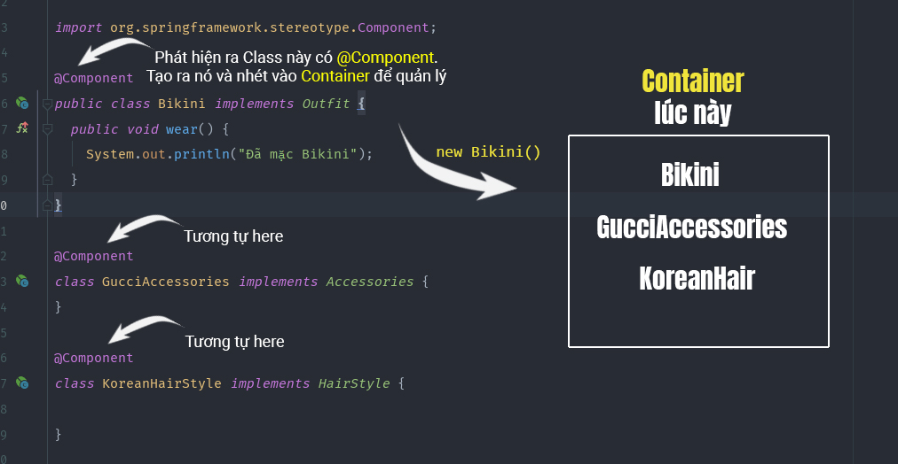
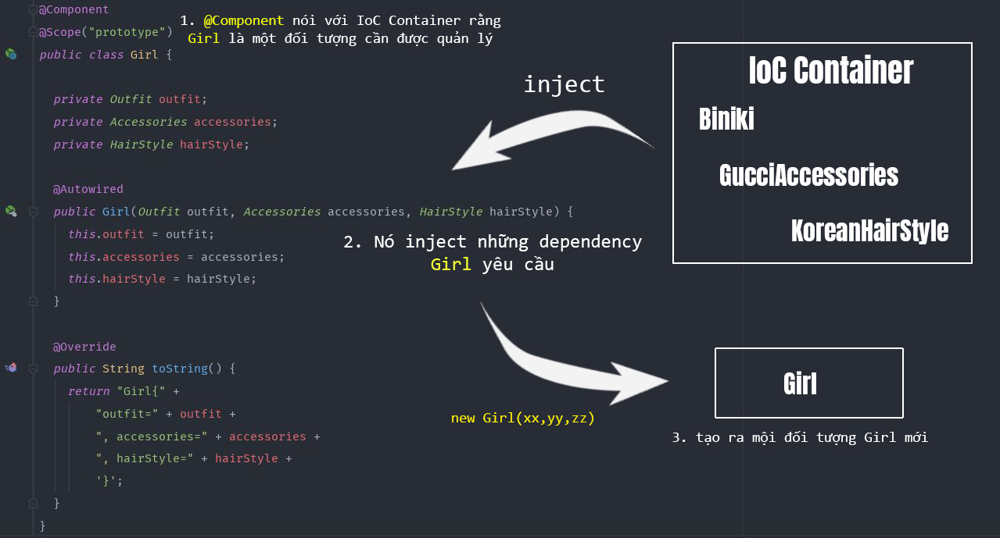

Xin chào tất cả các bạn, trước khi đi vào chi tiết bài hôm nay, các bạn cần đọc cho mình các khái niệm sau:

[Khái niệm Dependency Injection và Inversion Of Control][link-di-ioc] 

Nếu chưa biết các khái niệm này thì bạn nên đọc chúng tại link mình trích dẫn, sau đó quay lại học tiếp phần này, như vậy sẽ hiểu rõ hơn.

### IoC Container trong Spring

Nếu các bạn đã đọc bài viết `Inversion of Control` ở trên, sẽ thấy là `Spring` sẽ đảm nhiệm thay chúng ta việc `khởi tạo` object, `quản lý` nó hộ chúng ta. Khi các object cần các `dependency` gì nó sẽ `inject` luôn trong thời điểm khởi tạo.

Đối tượng chịu trách nhiệm tạo và quản lý đó tên là `IoC Container`

{:class="center-image"}

Đến đây nhiều bạn sẽ thắc mắc. Thế làm sao nó biết được `Outfit` lấy đâu ra, `Accessories` đâu ra, v.v..

Đúng, nó sẽ không biết lấy những cái ý ở đâu ra, nếu chúng ta không nói trước với `IoC Container`. Vậy nói với nó bằng cách nào?

Để biết nó làm như thế nào thì mình sẽ vừa `code` vừa giải thích cho bạn.


### Tạo Spring Project với Maven

```xml
<?xml version="1.0" encoding="UTF-8"?>
<project xmlns="http://maven.apache.org/POM/4.0.0"
  xmlns:xsi="http://www.w3.org/2001/XMLSchema-instance"
  xsi:schemaLocation="http://maven.apache.org/POM/4.0.0 http://maven.apache.org/xsd/maven-4.0.0.xsd">
  <modelVersion>4.0.0</modelVersion>

  <groupId>vn.loda.springboot</groupId>
  <artifactId>dependency-injection</artifactId>
  <version>1.0-SNAPSHOT</version>

  <parent>
    <groupId>org.springframework.boot</groupId>
    <artifactId>spring-boot-starter-parent</artifactId>
    <version>2.0.5.RELEASE</version>
  </parent>
  
  <properties>
    <maven.compiler.target>1.8</maven.compiler.target>
    <maven.compiler.source>1.8</maven.compiler.source>
  </properties>

  <dependencies>
    <dependency>
      <groupId>org.springframework.boot</groupId>
      <artifactId>spring-boot-starter</artifactId>
    </dependency>
  </dependencies>

</project>
```
Các bạn tạo Project như bình thường và copy đoạn xml trên vào file `pom.xml` của bạn. Thế là chúng ta đã có một `Spring project`. Chúng ta sử dụng `dependencies` của `Spring boot` còn về bản chất thì không khác nhau.

### @Component

Tạo ra các `Interface` cần thiết:

```java
// Có cô gái nào mà không cần phụ kiện trên người cơ chứ :3 bông tai, vòng tay, v.v..
public interface Accessories {
}

// Có tý bồng bềnh phồng phềnh trên tóc ms xinh đc.
public interface HairStyle {
}
// Cuối cùng là Outfit
public interface Outfit {
  public void wear();
}
```

`Implement` tất cả các `Interface` này:

```java
import org.springframework.stereotype.Component;
// Một bộ Bikini, bạn có thể tạo thêm nhiều bộ quần áo khác, chỉ cần implement Outfit là được
@Component
public class Bikini implements Outfit {
  public void wear() {
    System.out.println("Đã mặc Bikini");
  }
}

// Phụ kiện Gucci nhờ :3
@Component
public class GucciAccessories implements Accessories {
    // Class chỉ mang tính minh họa, không có gì cả
}

// Tóc hàn quốc cho xinh
@Component
public class KoreanHairStyle implements HairStyle {
    // Class chỉ mang tính minh họa, không có gì cả
}
```

Ở đây các bạn sẽ thấy cái lạ mắt nhất chính là cái `@Component`. Nó là một `Annotation` được `Spring` cung cấp.

```java
import org.springframework.stereotype.Component;
```
`@Component`: Sẽ báo cho `IoC Container` biết là bọn tao ở đây này, comehere. Vậy là `IoC Container` biết được có một thằng `Bikini` thuộc `interface Outfit` đang tồn tại nên sẽ **Tạo ra** đối tượng `Bikini` rồi lưu nó vào trong `Container`.


{:class="center-image"}

Lúc này, `IoC Container` đã và đang quản lý 3 đối tượng là `Bikini`, `GucciAccessories`, `KoreanHair` Và những đối tượng này được gọi với thuật ngữ là `Bean`

> `Bean` ám chỉ đối tượng được `Container` quản lý

### @Autowired

Tạo ra `class Girl`:

```java

import org.springframework.beans.factory.annotation.Autowired;
import org.springframework.context.annotation.Scope;
import org.springframework.stereotype.Component;

@Component
@Scope("prototype")
public class Girl {

  private Outfit outfit;
  private Accessories accessories;
  private HairStyle hairStyle;

  @Autowired
  public Girl(Outfit outfit, Accessories accessories, HairStyle hairStyle) {
    this.outfit = outfit;
    this.accessories = accessories;
    this.hairStyle = hairStyle;
  }

  @Override
  public String toString() {
    return "Girl{" +
        "outfit=" + outfit +
        ", accessories=" + accessories +
        ", hairStyle=" + hairStyle +
        '}';
  }
}
```

Các bạn thấy `Girl` cũng có `@Component`, vậy chúng ta hiểu  nó cũng là 1 `Bean`, và `IoC Container` sẽ tới tìm và tạo ra nó. cái này giải thích ở trên rồi.

Cái cần nói ở đây là cái thằng `@Autowired`.

`@Autowired`: Là `Annotation` được chú thích trên một thuộc tính (`field`) hoặc `function` để nói với `IoC Container` là hãy tự `inject` những thuộc tính này vào hộ tao.

Lúc này hành vi của thằng `IoC Container` sẽ như sau:

1. Nhận thấy `Girl` cũng có `@Component` nên nó phải tạo 1 `Bean Girl`

2. Thấy `Girl` có các thuộc tính còn thiếu, được đánh dấu `@Autowired`. Tìm trong `Container` các giá trị phù hợp và `inject` vào các thuộc tính có `@Autowired` 

3. Tạo ra một `new Girl` từ những gì đã `inject`. Cất nó vào `Container` để quản lý luôn.

{:class="center-image"}


### Chạy chương trình

```java
import org.springframework.beans.factory.annotation.Autowired;
import org.springframework.boot.CommandLineRunner;
import org.springframework.boot.SpringApplication;
import org.springframework.boot.autoconfigure.SpringBootApplication;
import org.springframework.context.ApplicationContext;

@SpringBootApplication
public class Main implements CommandLineRunner {
  public static void main(String[] args) {
    SpringApplication.run(Main.class, args);
  }

  @Autowired
  private ApplicationContext context;

  @Override
  public void run(String... args) throws Exception {
    Girl girl = context.getBean(Girl.class);
    System.out.println(girl);
  }
}

```

`@SpringBootApplication`: Chỉ cần sử dụng một lần trên class chính. Để nói rằng `Project` của chúng ta là `Spring Project`, nó sẽ `Config` tự động giúp bạn.

```java
// Bạn phải wrapper hàm Class có annotation  @SpringBootApplication bằng SpringApplication.run() thì mới được Spring hỗ trợ. Còn không thì cái @SpringBootApplication cũng như vứt đi à

SpringApplication.run(Main.class, args);
```

> `Spring Boot` đơn giản chỉ là một mở rộng của `Spring Framework`. kế thừa các tinh hoa và giảm thiểu hết các đoạn code thừa hoặc dài dòng đi.

Vì cái hàm ` main(String[] args)` của bạn đã bị wrapper bằng `Spring`. Nên bạn muốn chạy cái gì thì phải `immplement` cái `CommandLineRunner` và code mọi thứ trong cái hàm ` run(String... args) ` mà `Spring` cung cấp thì nó mới chạy.

Tới đây, chúng ta sẽ thấy `ApplicationContext`. Cái này chính là `IoC Container` đấy các bạn.

```java

@Autowired // Bảo Spring tự inject chính cái Container của nó cho mình nghịch chút
private ApplicationContext context; // Cái này có thể hiểu chính là Container đấy các bạn, nó chứa mọi Bean trong này.

@Override
public void run(String... args) throws Exception {
Girl girl = context.getBean(Girl.class); // Lấy Girl đã được tạo ra xem.
System.out.println(girl);

Girl girl2 = context.getBean(Girl.class);
System.out.println(girl == girl2); // Kết quả ra False
// Chứng tỏ mỗi lần lấy ra chúng ta tạo ra 1 Cô gái khác nhau

Outfit outfit = context.getBean(Outfit.class);
System.out.println(outfit);
Outfit outfit2 = context.getBean(Outfit.class);
System.out.println(outfit == outfit2); // Kết quả ra True
// Chứng tỏ Outfit là singleton.

}
```
Khi chạy chương trình, bạn sẽ thấy là với class `Girl` thì mỗi lần lấy ra, nó là một `instance` hoàn toàn mới, nhưng `Outfit` thì bạn có lấy ra bao nhiều lần, nó vẫn chỉ là 1 `instance` duy nhất (`singleton`).

Lý giải hiện tượng này, chúng ta quay lại ngược trở lại đoạn code `Girl` và `Outfit`, và sẽ nhận ra, chúng nó khác nhau duy nhất ở điểm chí mạng này:

```java
@Scope("prototype")
```
Bạn xóa `@Scope("prototype")` đi và chạy lại thử xem 😅

Đến đây bạn có thể hiểu, nếu như không nói gì. toàn bộ `Bean` trong `IoC Container` đều là `Singleton`.

Còn nếu muốn `Bean` được khởi tạo theo ý mình, bạn phải cung cấp thêm `Annotaion` `@Scope`:

* `@Scope("prototype")`: tương đương với việc tạo `new` Object

* `@Scope("singleton")`: Không nói gì, thì `Spring` sẽ mặc định là scope này. `Singleton`, đôi tượng chỉ được tạo ra duy nhất một lần.

Ngoài ra còn có các kiểu `scope` bổ sung cho project dạng `Web Application`. Chúng ta chưa cần đề cập nó ở đây.


### @Configuration và @Bean

Bây giờ khi chạy chương trình tạo ra `Girl` ở trên, thì có một vấn đề là `Cô gái` nào cũng sẽ tự `inject` cái bộ `Bikini` vào người. Trong khi thực tế, mọi cô gái được tạo ra, đáng ra phải `Naked` mới đúng 😗

Mình quyết định sẽ `config` cho chương trình này một chút, để mọi `Girl` khi được tạo ra sẽ `Naked`:

```java
import org.springframework.context.annotation.Bean;
import org.springframework.context.annotation.Configuration;

@Configuration // Đánh dấu một Class là Config, class này sẽ được ưu tiên tìm kiếm
public class GirlConfig {

  @Bean // Gắn đối tượng Outfit trả về trong hàm này là 1 bean. IoC Container sẽ quản lý nó giống @Component luôn
  public Outfit defaultOutfit(){
    return new Naked(); // function này trả về một đối tượng Naked()
  }
}

public class Naked implements Outfit {

  @Override
  public void wear() {
    System.out.println("ngượng quá điii!!!");
  }
}

```

Mình giải thích: 

`@Configuration`: Là một `Annotation` đặc biệt của `Spring`. Khi một class được đánh dấu là `@Configuration` thì `Spring` hiểu class này là nơi chúng ta **_cấu hình_**, **_cài đặt_** và **_tạo ra_** những `Bean` cần thiết cho chương trình, nên nó sẽ chạy vào `Class` này trước tiên.


`@Bean`: Chỉ được gắn trên `function` và nó sẽ đánh dấu đối tượng trả về trong `function` là `bean` và `IoC Container` sẽ phải quản lý nó. Tương tự `@Component`. tuy nhiên `@Bean` chỉ gắn trên `function` mà thôi.

Về hành vi, `IoC Container` sẽ tìm kiếm, lục lọi tìm ra toàn bộ các `@Configuration` trong project và gọi hết các `Function` có chứa `@Bean` trong đó. Lấy ra các `bean` mà hàm trả về và quản lý nó.

Có thể coi đây là một cách khởi tạo ra `bean` cho các `class` theo cách mình muốn, tùy thuộc cách chúng ta gán cho đối tượng trong `function` như nào mà `Bean` cho cái `class` đó sẽ như vậy.

Tuy nhiên, khi chạy chương trình trên, bạn sẽ có lỗi:

```java
Consider marking one of the beans as @Primary, updating the consumer to accept multiple beans, or using @Qualifier to identify the bean that should be consumed
```

Bạn biết vì sao chưa? Vì lúc này, chúng ta có tới 2 thằng `Outfit` trong `IoC Container`.

```java
@Component // Có component, nên IoC tạo ra 1 Outfit trong Container
public class Bikini implements Outfit {
  public void wear() {
    System.out.println("Đã mặc Bikini");
  }
}

@Configuration // Vì là Configuration, nên IoC sẽ chạy class này và tạo ra toàn bộ các @Bean trong nó.
public class GirlConfig {

  @Bean // Có @Bean => tạo ra 1 Outfit là Naked trong Container.
  public Outfit defaultOutfit(){
    return new Naked(); 
  }
}

class Girl{
  // Lúc này IoC Container không biết nên inject thằng outfit nào vào đây.
  @Autowired private Outfit outfit;
}

```

Có 2 hướng giải quyết:

### 1. @Primary

Đánh dấu cái `Naked` là ưu tiên. Như vậy khi có nhiều `Bean` dạng `Outfit`, nó sẽ luôn ưu tiên `inject`  `Naked` trước. Đúng ý chúng ta. Khởi tạo ra `Girl` là phải `Naked`
```java
  @Bean
  @Primary
  public Outfit defaultOutfit(){
    return new Naked();
  }
```

### 2. Qualifier

Khi bạn có nhiều `Bean` chung kiểu, gây bối rối cho `Spring` thì bạn phải đặt tên cho nó và chỉ định xem cái nào sẽ ở đâu

```java
@Bean("naked")
public Outfit defaultOutfit(){
  return new Naked();
}


@Component
@Scope("prototype")
public class Girl {
  @Autowired
  @Qualifier("naked")
  private Outfit outfit;
  @Autowired private Accessories accessories;
  @Autowired private HairStyle hairStyle;
}

// Nhớ bỏ cái dòng lệnh này đi 
// Outfit outfit = context.getBean(Outfit.class);
// System.out.println(outfit);
// Outfit outfit2 = context.getBean(Outfit.class);
// System.out.println(outfit == outfit2);

// Thay bằng 
// context.getBean("naked", Outfit.class)
// hoặc context.getBean("bikini", Outfit.class)
```


### Lời kết

Tới đây, mình đã giới thiệu xong với các bạn cách `Spring Framework` hoạt động và sử dụng nó trong `code`. 

Nắm được lý thuyết này cũng như các `Annotation` ở trên là bạn đã có thể `code` xoành xoạch cái `Framework` này rồi. 

Nhớ đón đọc các bài sau về hướng dẫn lập trình `Spring boot` nhé.

Chúc các bạn học tập tốt và nhớ chia sẻ cho bạn bè học cùng ahehe :v 

[link-di-ioc]: https://loda.me/Giai-thich-Dependency-Injection-(DI)-va-Inversion-of-Control-(IOC)/
