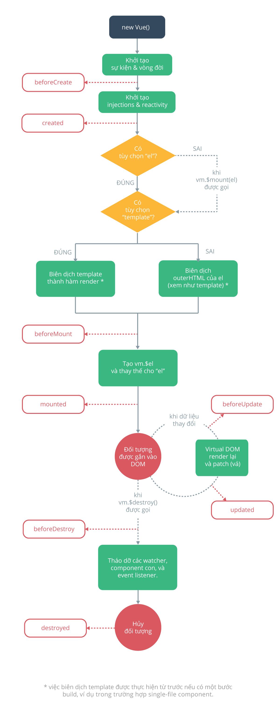

Đối tượng `Vue` là nội dung chúng ta sẽ tìm hiểu kỹ ở bài này.

[Bài 1: Cài đặt, viết chương trình Hello World với Vue.js](https://loda.me/Cai-dat-viet-chuong-trinh-Hello-World-voi-Vue.js/)

### Cách khởi tạo

Tạo ra một đối tượng `Vue`, bạn cần truyền vào `Property` cho nó. Trong đó phải khai báo các phần tử `el` hoặc `data`. Ngoài ra còn một số `Property` khác, chúng ta sẽ nói ở dưới.

```js
new Vue({
  el: "#app",
  data: {
  	msg: 'Hello Loda'
  }
})
```

### Thuộc tính

Khi một đối tượng `Vue` được khởi tạo, tất cả các thuộc tính (`property`) được tìm thấy trong object `data` sẽ được thêm vào **reactivity system** (hiểu nôm na là “hệ thống phản ứng”) của Vue. Điều này có nghĩa là view sẽ “react” (phản ứng) khi giá trị của các thuộc tính này thay đổi, và tự cập nhật tương ứng với các giá trị mới.

```js
// Chúng ta khởi tạo một object "data"
var data = { a: 1 }

// Object này được truyền vào một đối tượng Vue
var vm = new Vue({
  data: data
})

// Truy xuất đến thuộc tính của đối tượng 
// trả về giá trị của object "data" đã khởi tạo 
vm.a == data.a // => true

// Thay đổi thuộc tính của vm cũng
// ảnh hưởng đến dữ liệu ban đầu
vm.a = 2
data.a // => 2

// ... và ngược lại
data.a = 3
vm.a // => 3
```

### Phương thức

Đã là **đối tượng** thì chúng ta nghĩ ngay tới lập trình hướng đối tượng, đó là có thuộc tính thì phải có phương thức.

Để khai báo một phương thức trong `Vue`. Chúng ta sử dụng `methods`

```js
var vm = new Vue({
    el: "#app",
    data: {
        vueValue: 'aay zaauuu!'
    },
    methods: {
        showMessage(){
            console.log(this.vueValue);
        },
        
        getMessage(){
            return this.vueValue;
        }
    }
});

vm.showMessage();
console.log(vm.getMessage())
```

Hết sức đơn giản. Ở đây, chúng ta xài toán tử `this` để gọi tới đối tượng `Vue`.

<iframe width="100%" height="300" src="//jsfiddle.net/lodanamnh/m267jfpu/7/embedded/js,html,result/" allowfullscreen="allowfullscreen" allowpaymentrequest frameborder="0"></iframe>

### Vòng đời của đối tượng Vue

Trong quá trình khởi tạo và sử dụng cho tới khi kết thúc. `Vue` đi qua nhiều giai đoạn khác nhau, và mỗi giai đoạn nó sẽ gọi tới một function đặc biệt. Chúng ta gọi đây là  `lifecycle hook`

Ví dụ, khi chúng ta `new Vue()` Thì là lúc chúng ta khởi tạo nó. Khi khởi tạo xong, nó sẽ thông báo cho chúng ta biết thông qua function `created`

```js
new Vue({
  data: {
    a: 1
  },
  // Hàm created sẽ mặc định được gọi tới, khi Vue khởi tạo xong. 
  created: function () {
    // `this` trỏ đến đối tượng Vue hiện hành
    console.log('giá trị của a là ' + this.a)
  }
})
// Mở console và xem:
// Mặc dù chúng ta không làm gì, nó vẫn sẽ in ra dòng ở dưới.
// => "giá trị của a là 1"
// Chứng tỏ hàm created() đã được gọi
```

Chúng ta sẽ sử dụng các hàm vòng đời này để thực hiện việc fetch dữ liệu từ api hay xử lý các sự kiện phức tạp khác. Dưới đây là vòng đời của `Vue`:

{:class="center-image"}


Tới đây, các bạn đã nắm được đối tượng `Vue` rồi! xem chương sau để ứng dụng nó vào trang web của bạn nhé.

Chúc các bạn học tập tốt!
