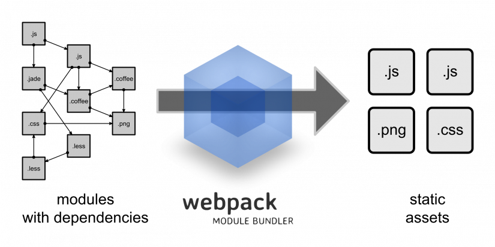

`Webpack` là một công cụ giúp chúng ta build và quản lý project của mình dưới dạng module. 

Khi thực tế cho thấy ở phía frontend ngày càng phình to hơn về các file javascript cũng như nhiều công nghệ mới. Kéo theo đó dẫn tới sự cồng kềnh của một project. Dẫn tới cần có một công cụ giúp chúng ta quản lý và chia module. Lúc cần thì lấy ra sử dụng chứ k xài bừa bãi.

{:class="center-image"}

### Mục tiêu của Webpack
* Quản lý dependency và load lên sử dụng khi cần thiết
* Thời gian khởi tạo ngắn
* static files cũng có thể trở thành module
* linh hoạt sử dụng mọi thư viện 3rd
* Phù hợp với các dự án lớn

### Cài đặt Webpack vào project của bạn

Yêu cầu: Máy tính của bạn cần cài đặt `Node.js` và `Node Package Manager (npm)`.

Nếu chưa có, bạn có thể tải về tại đây:
[https://www.npmjs.com/get-npm](https://www.npmjs.com/get-npm)


Chúng ta sẽ tạo ra một project đơn giản để minh họa cách `Webpack` hoạt động:

```bash
mkdir webpack-example
cd webpack-example
npm init -y
npm install webpack --save-dev
npm install webpack-cli --save-dev
```
Cấu trúc thư mục:

```bash
  webpack-example
  |- package.json
  |- index.js
  |- data.js
  |- /dist
    |- index.html
```

Tạo ra một module bằng câu lệnh `export`

```js
// File data.js
var courses = [
	'java',
	'spring boot',
	'ml'
];

export default {
  name: 'loda',
  data: courses
}
```

Sử dụng module bằng lệnh `import`

```js
// index.js
import object from './data.js'

console.log(object);
```

Đây là cách chúng ta phân chia project của mình thành các module, vừa ngắn gọn, lại giúp code sáng sủa hơn rất nhiều.

Tuy nhiên, khi mang các file này ra chạy thì sẽ không được đâu các bạn, vì cái `import` với `export` là chúng ta quy định với thằng `Webpack` thôi. Còn `Browser` k hiểu đâu, nó sẽ không biết cái `object` kia ở đâu ra.

Để chạy được, chúng ta sử dụng `Webpack` để ghép nối các module lại thành 1 file duy nhất, khi đó `Browser` sẽ hiểu được.


### Webpack config

Trước khi `build`, chúng ta sẽ phải config cho `Webpack` để nó biết biết là build ra file tên gì, và đặt ở đâu.

Tạo file `webpack.config.js` tại thư mục gốc:

```js
const path = require('path');

module.exports = {
  entry: './index.js', // Đầu vào là file index.js lúc nãy
  output: {
    filename: 'main.js', // Tạo ra file tên main.js
    path: path.resolve(__dirname, 'dist') // đặt vào thư mục dist
  }
};
```

Okay, giờ thì chạy câu lệnh tại thư mục gốc của project:

```bash
$  webpack
```

Vào xem thư mục dist lúc này, sẽ có file `main.js`, chứa toàn bộ code của dự án khi đã ghép các module lại với nhau:

```js
//...
var r={name:"loda",data:["java","spring boot","ml"]};
console.log(r);
//...
```
Mông lung như một trò đùa phải không :)))

Chúc các bạn sử dụng Webpack thành công!


